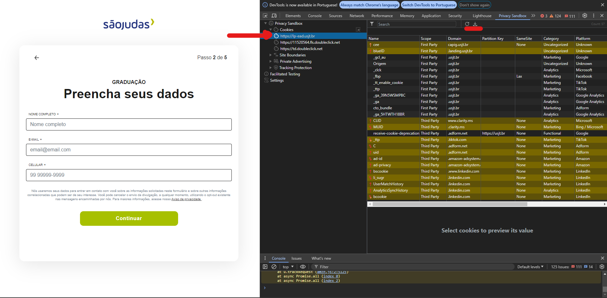

<h1 align="center">
  <a
    target="_blank"
    href="https://hagens.com.br/"
  >
    
  </a>
</h1>

# Privacy Sandbox - Hagens

O objetivo deste repositório é facilitar a utilização da ferramenta PSAT-cli. Para isso, a pasta "examples" contém arquivos que auxiliam na jornada de configuração, com exemplos práticos e instruções detalhadas.

# Interface de linha de comando do PSAT - Iniciando na ferramenta

Para utilizar a ferramenta é necessário seguir os seguintes passos:

+ 1 - Clone este repositório

+ 2 - Você deve ter instalado na sua máquina as seguintes ferramentas:
  + 2.1 - [Node.js](https://nodejs.org/en/download/current)
  + 2.2 - [VS Code](https://code.visualstudio.com/)

+ 3 - Abra o terminal no diretório do projeto e execute os comandos:

  ```
    npm install
  ```

  ```
    npm run cli:build
  ```

+ 4 - Comandos para usar a ferramenta:
  + 4.1 - Analise uma URL específica com:

  ```
    npm run cli -- -u https://bbc.com
  ```

  + 4.2 - Analise uma mapa do site em XML:

  ```
    npm run cli -- -s https://example.com/sitemap_index.xml
  ```

  + 4.3 - Analise URLs a partir de um arquivo CSV:

  ```
    npm run cli -- -c ./examples/urls_csv_psat.csv
  ```

  + 4.4 - Analise um arquivo XML do mapa do site:
  
  ```
    npm run cli -- -p ./examples/hagens_sitemap.xml
  ```

+ 5 - Ferramentas complementares:
  + 5.1 - Crie um arquivo do mapa do site com: [XML - Site Maps](https://www.xml-sitemaps.com/)
  + 5.2 - Consulte mais informações sobre os Cookies em: [Cookie Search](https://cookiesearch.org/)

+ 6 - Acesse a [Wiki](https://github.com/GoogleChromeLabs/ps-analysis-tool/wiki/PSAT-Command-Line-Interface#getting-started-with-psat-cli) oficial do projeto

+ 7 - Caso de uso: execução de um lote de mapas do site em Windows:
  + 1 - Execute as etapas 1, 2 e 3 (uma única vez);
  + 2 - Abra o prompt e execute o comando:

  ```
    wsl --install
  ```

  + 3 - Em seguida execute:

  ```
    wsl --install -d Ubuntu
  ```
  
  + 4 - Abra o projeto no VS Code;

  + 5 - Abra o terminal no VS Code com o comando:

  ```
    Ctrl + Shift + '
  ```

  + 6 - No terminal digite o comando:

  ```
    wsl
  ```

  + 7 - Digite os comandos:

  ```
    sudo apt update
    apt install python3-pip
    pip install -r ./hagens_psat/requirements.txt
  ```

  + 8 - Execute o comando:

  ```
    ./start.sh
  ```

  + 9 - Siga as intruções exibidas no terminal;
  + 10 - Execute o comando:

  ```
    ./auto-batch-site-map.sh
  ```

  + 11 - Para uma nova execução execute a partir da etapa 7.8:
  
+ 8 - Caso de uso: execução da extensão PSAT + Chrome Canary em SPA:
  + 1 - [Baixe o Chrome Canary](https://www.google.com/intl/pt-BR/chrome/canary/);
  + 2 - [Instale a extensão PSAT no Canary](https://chromewebstore.google.com/detail/privacy-sandbox-analysis/ehbnpceebmgpanbbfckhoefhdibijkef);
  + 3 - Abra o navegador e ative a extensão PSAT;
  + 4 - Abra o fluxo que será testado, por exemplo, [Ficha USJT](https://lp-ead.usjt.br/inscreva-se);
  + 5 - Para cada etapa do fluxo é necessário realizar o download dos cookies que foram rastreados pela ferramenta, como é mostrado na Imagem 1;
  + 6 - Ajuste o nome do arquivo para identificar a etapa no qual ele foi extraído;

<a name="logo" href="https://lp-ead.usjt.br/inscreva-se"></a>
> **Imagem - 1:** Extensão PSAT no Chrome Canary sendo utilizado em uma aplicação SPA. **Fonte:** Autoria própria.
<hr>

<h1 align="center" style="display: block; font-size: 2.5em; font-weight: bold; margin-block-start: 1em; margin-block-end: 1em;">
<a name="logo" href="https://www.privacysandbox.com"></a>
</h1>

# Privacy Sandbox

[Privacy Sandbox](https://privacysandbox.com/) is a multi-year [initiative by Google](https://developers.google.com/privacy-sandbox) for building a more private web by defining a set of building blocks (i.e. proposed APIs) enabling [a new privacy model for the web](https://github.com/michaelkleber/privacy-model). Privacy Sandbox encompasses replacing functionality powered by third-party cookies with privacy-preserving alternatives, deprecating third-party cookies, and ensuring developers have a well-lit path to the new capabilities of the platform, and avoid pursuing tracking via other means.

This repository is home to the Privacy Sandbox Analysis DevTools extension (PSAT), which is a tool aimed at assisting developers in preparing their websites for the changes that are happening in Chrome in the context of Privacy Sandbox, and ensuring a seamless transition to a more private web.

# Learn how to use PSAT

PSAT brings new and experimental capabilities to complement and expand Chrome DevTools and facilitate the analysis and debugging of sites in the context of PS. You can start by [installing and running PSAT](https://github.com/GoogleChromeLabs/ps-analysis-tool/wiki/Evaluation-Environment#installing-psat-from-chrome-web-store) right away!

And to learn everything about using PSAT, check out the repository's [wiki page](https://github.com/GoogleChromeLabs/ps-analysis-tool/wiki), which contains detailed information about analyzing and debugging specific scenarios, and will help you map them to the specifics of your site.

# Call to Action

The goal of this tool is to assist users in getting knowledge and insights regarding [the upcoming deprecation of the way in which 3P cookies work](https://privacysandbox.com/open-web/#the-privacy-sandbox-timeline), and the status and behaviors of the new Privacy Sandbox APIs. You can use the tool to analyze your site(s), and your browsing experience, detect and report breakages, get support from Google on fixes, and, if you are a developer of solutions that require cookie capabilities being deprecated, learn how to make them happen leveraging the new platform APIs that allow you to achieve the same goals in a privacy-preserving way.

If you are a **first-party site developer**, you are responsible for the creation and maintenance of websites. A significant part of your work involves auditing and managing third-party dependencies to ensure that your websites run smoothly and securely. Leverage the guidance and the tooling available to help you understand the changes to third-party cookie use cases, how to integrate Privacy Sandbox APIs into your solutions, and how to troubleshoot issues that may arise.

If you are a **third-party service developer using valid cookie use cases**, you are responsible for creating and maintaining services that are integrated into other websites as third-party dependencies. If your technologies rely on cookies for various functions, such as maintaining user sessions or tracking user preferences, leverage the guidance and tooling provided to help you stay informed about the effective and responsible use of cookies.

If you are a **third-party service provider transitioning away from cookies**, you are responsible for developing third-party services that rely on cookies (such as tracking, data storage, or user session management), which need to transition to alternate methods due to evolving regulations and platform changes. Leverage the guidance and tooling available to help you integrate Privacy Sandbox APIs into your solutions, and help troubleshoot any issues that may arise.

If you are a **Website owner or technology leader**, you are responsible for technical and business decision-making, and you can leverage the guidance and tooling available to get a thorough understanding of the transformative shift that is taking place for 3P Cookies and the potential impact on user experience and privacy.

Ultimately, the web ecosystem, together, will navigate successfully this crucial transition towards a more private web platform. Let's make it happen!
